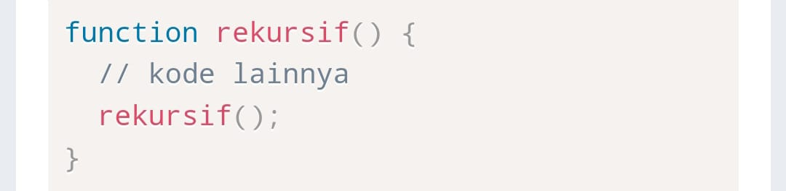
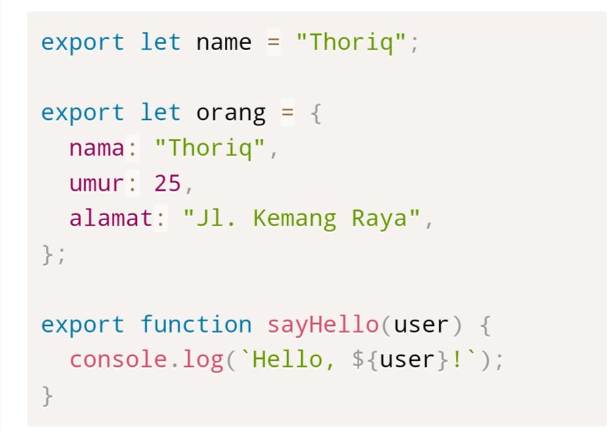

# JAVASCRIPT INTERMEDIET

1.  ## ARRAY
 Array merupakan variabel yang bisa menampung lebih dari satu nilai. nilai index dari array dimulai dari 0

- Kenapa kita menggunakan Array?
1. mempermudah pengelolahan data/value.

2. Manajemen memori

## Karateristik Array
- Variabel pada array ialah variabel jamak yang mempunyai banyak elemen dan diacu dengan nama yang sama.

- Array pada JavaScript bertipe **OBJECT**

- Array pada JavaScript memiliki fungsi/method bawaan yang biasa bisebut dengan lenght yang berfungsi mengitung jumlah elemen di dalamnya

- Elemen pada array boleh memiliki tipe data yang berbeda.

## forEach()
Digunakan untuk melakukan iterasi dalam mengakses elemen *array* 

## map()
Selain forEach(), ada juga metode perulangan pada array yaitu map() biasanya digunakan untuk melakukan perulangan sambil mengecek/melakukan operasi terhadap setiap element array

## reduce()
melakukan operasi matematika pada element *array* atau sekedar mengubah struktur pada *array*

## filter()
berfungsi untuk membuat sebuah *array* baru dengan memperhatikan kondisi tertentu pada setiap elemen dari array yang sudah ada.

# ARRAY MULTIDIMENTION
 Merupakan array yang di dalamnya terdapat data array lagi

## Membuat Array Multidimensi

untuk membuat array multidimensi, kita dapat mendeklarasikan dengan menggunakan array literal seperti di bawah ini.

## Looping Array Multidimensi

array multidimensi bisa di looping dengan sama seperti array pada umumnya. untuk itu berikut contoh looping menggunakan 

1. forEach()
2. map()

# REKURSIF
Suatu teknik pemrograman yang menggunkan function atau fungsi/ pemanggilan fungsi yang berulang. contohnya sebagai berikut.

Rekrusif sangat cocok untuk menyelesaikan permasalahan pada **matematika,fisika,kimia** dan **operasi perhitungan**

Ada 3 hal yang perlu diperhatikan untuk memutuskan kapan menggunakan rekrusif dan kapan menggunakan iteratif :

1. Jika fokus kamu adalak kecepatan pada aplikasi dan memori, kamu harus menggunakan iteratif.
2. Jika data yang di uji tidak banyak, kamu dapat menggunakan *rekursif*
3. Beberapa algoritma secara natural lebih cocok menggunkan rekursif

Fokus dari teknik ini adalah memudahka kamu memecahkan permasalahn besar menjadi bagian-bagian kecil.

## Membuat Rekursif
Struktur dasar Function rekursif

# REGEX
Merupakan deretan karakter spesial yang menggambarkan pattern atau pola untuk pencarian teks pada sebuah *sting* atau *document*

Kapan kita harus menggunakan regex?

1. Validasi *input* dari sebuah form
2. mencari keyword tertentu pada email atau halaman website
3. mencari ip addres dalam kisaran tertentu

## Method pada Regex

1. exec()
- digunakan untuk mencari string yang kita inginkan.

2. test()
- digunakan untuk string matching dari pencarian teks pada pola regex yang tersedia dengan mengembalikan nilai *boolean* (true/false)

# MODULE
Merupakan sebuah bagi javascript untuk mengisolasi kode dari suatu file kedalam sebuah file terpisah.

Mengapa menggunakan Module?
1. maintainabillity
- Mempermudah jika kita ingin menambahkan, menghapus dan merubah kode kita karena tidak mempengaruhi seluruh aplikasi kita

2. penggunaan nama variabel
- module memudahkan kita untuk memberikan alias nama variabel yang di import sehingga kita tidak dapat mengalami kesulitan untuk mengganti nama variabel.

3. reusable code

## Export
penggunaan export diawali dengan kata kunci export kemudian diikuti dengan nama variabel yang di export

contoh export variabel objek dan function

## Import
Import diibaratkan sebagai pasangan dari export. jadi import digunakan untuk menggunakan variabel yang sudah di export dari module lainnya

contoh dasar melakukan import variabel

# OOP
- OOP adalah suatu paradigma atau konsep di dunia pemrograman yang berorientasikan pada objek. Biasanya objek memiliki 2 komponen, yaitu ciri-ciri dari objek tersebut (properti) dan kemampuan yang dapat dilakukan oleh objek tersebut (method).

Contohnya pada dunia nyata terdapat objek makhluk hidup seperti manusia yang memiliki nama, umur, dan jenis kelamin. Manusia juga dapat melakukan aktifitas seperti tidur, belajar, bermain dan sebagainya.

Kenapa harus menggunakan OOP?

- Aplikasi yang dibuat semakin lama akan semakin besar dan baris kodenya pun semakin lama akan semakin banyak. Maka dari itu, kamu membutuhkan teknik baru untuk dapat mengatur manajemen kode yang kamu punya sehingga akan lebih mudah dikembangkan dan dilakukan update.

OOP memiliki 4 pilar utama yaitu:

1. Inheritance
2. Polymorphism
3. Encapsulation
4. Abstraction

# WEB STORAGE

Apa itu Cookies?

- Cookies adalah data kecil yang dikirim dari situs web dan disimpan di komputer kita oleh web browser saat kita menjelajah. Disebut data kecil karena maksimum data yang dapat disimpan dalam cookies adalah 4096 bytes (4 KB).

Namun ada beberapa kekurangan yang perlu kita perhatikan mengenai cookies di antaranya:

1. Setiap kita mengakses situs web, cookies juga kembali dikirim sehingga memperlambat aplikasi web kamu dengan mengirimkan data yang sama.
2. Cookies disertakan pada setiap HTTP request, sehingga mengirimkan data yang tidak dienkripsi melalui internet, maka saat kita ingin menyimpan data dalam cookies kita harus mengenkripsinya terlebih dahulu.
3. Cookies hanya dapat menyimpan data sebanyak 4KB.
4. Lalu cookies juga memiliki tanggal kadaluarsa. Tanggal ini telah ditentukan sehingga web browser bisa menghapus cookies jika tanggal sudah kadaluarsa atau tidak dibutuhkan.
